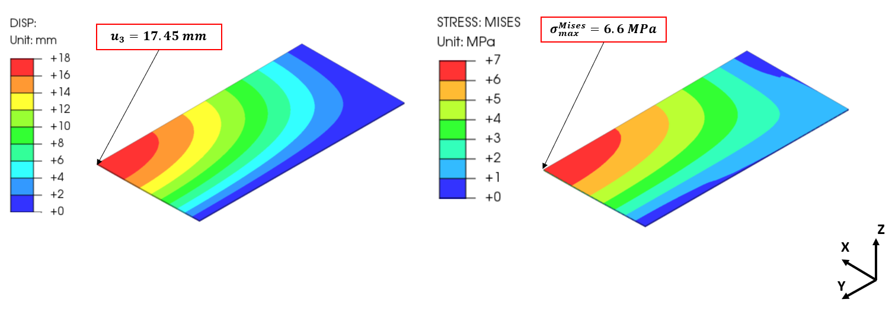
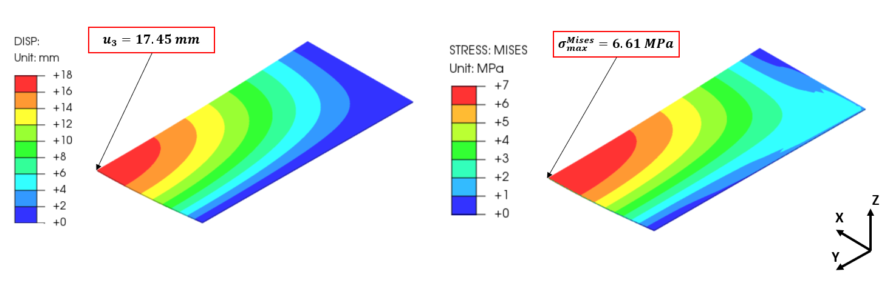
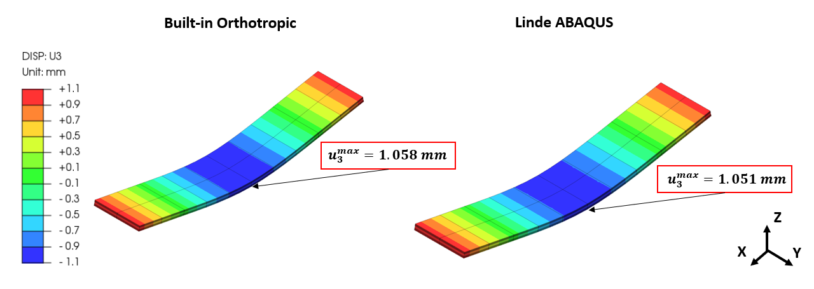
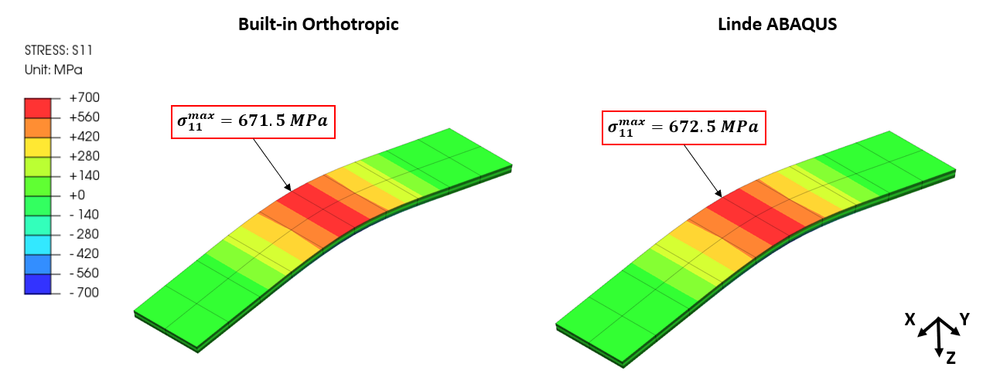
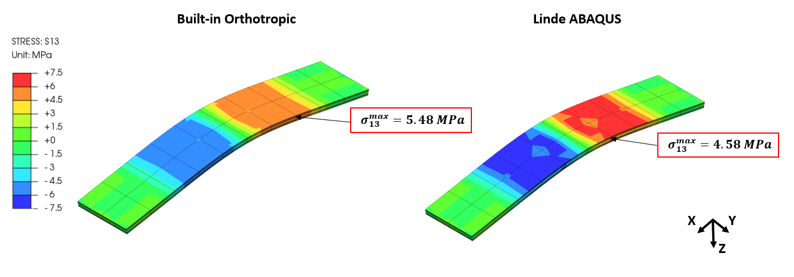
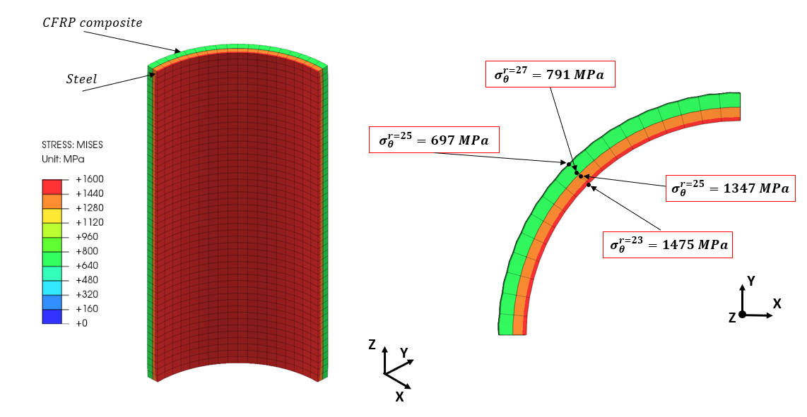
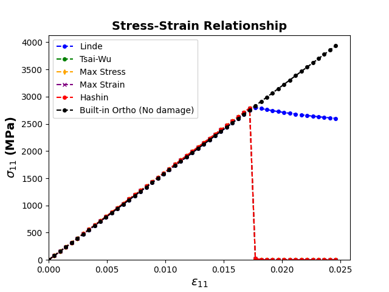
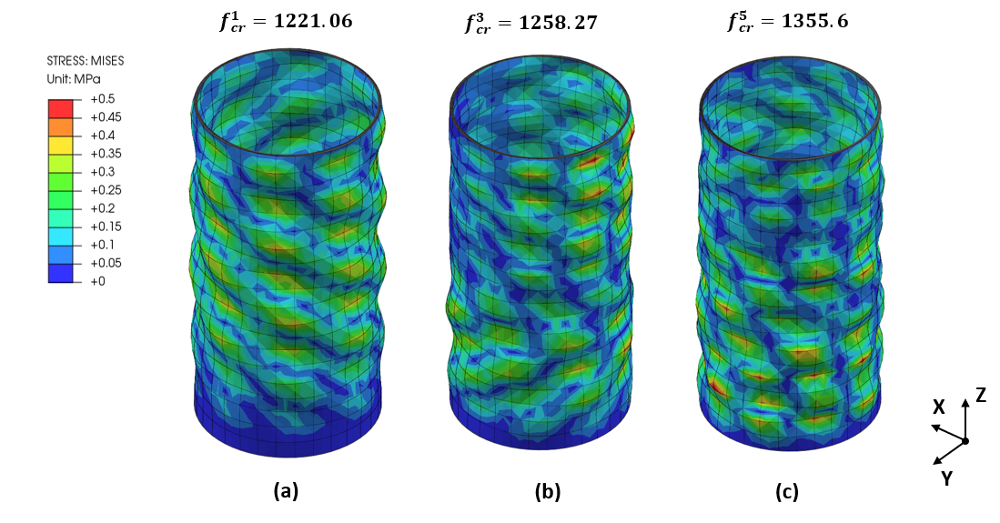
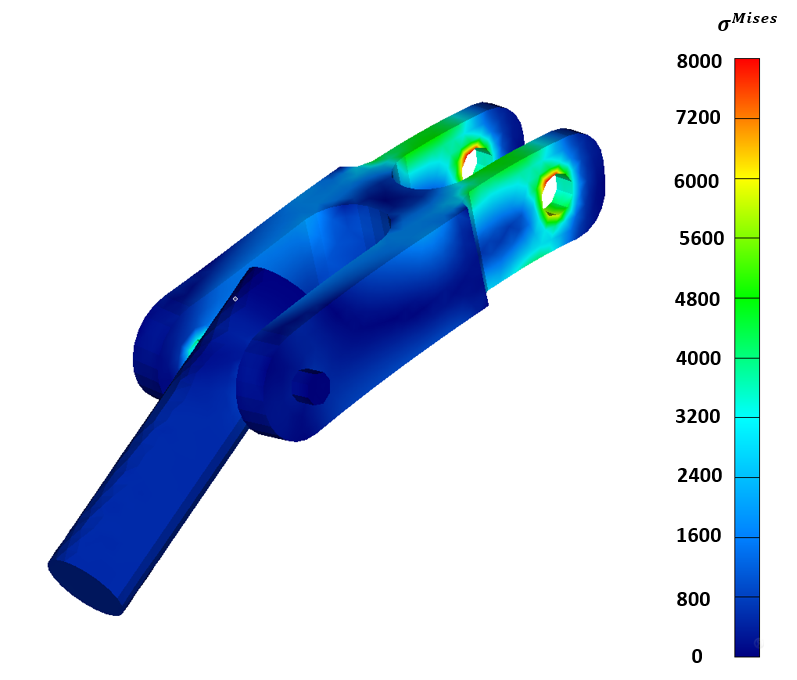
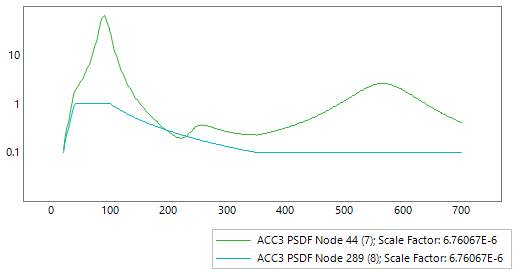

# Selected Finite Element Analysis (FEA) Projects

A collection of finite element analysis (FEA) projects covering static and dynamic analysis of linear and nonlinear behavior of composite (fiber-reinforced plastics) and metallic structures.

**Technical Stack**

*3D CAD*: Autodesk Fusion 360

*FEA Software*: FEMAP, NASTRAN, CalculiX (ABAQUS-like open source software), PrePoMax 

*Programming Languages*: Python, FORTRAN

## 1. [Composite Plate under Uniform Pressure](https://github.com/dmytrokuksenko/FEA-Portfolio/tree/main/cfrp-plate-bending)

The validation of the built-in and custom material model for fiber-reinforced plastic composites begins with the finite element analysis of a simply supported plate subjected to the uniform pressure. The plate has a width of 4,000 mm and a length of 2,000 mm. The thickness of the plate is 10 mm.

## 2. [Three-Point Bending of a Unidirectional Composite Laminate](https://github.com/dmytrokuksenko/FEA-Portfolio/tree/main/cfrp-three-point-bend)

The maximum displacement, bending stress, and interlaminar shear stress in a unidirectional composite laminate subjected to three point bending

## 3. [Composite Cylindrical Shell under Internal Pressure](https://github.com/dmytrokuksenko/FEA-Portfolio/tree/main/cylindrical-shell)

Cylindrical shell is another model provided by NAFEMS for benchmarking of the FEA results. The model has two materials, steel linear wrapped around with a carbon fiber-reinforced composite material. Both materials have a thickness of 2 mm. The inner radius of the cylindrical shell is 23 mm. The overall length of the shell is 200 mm. 

Stress distribution in the cylindrical shell is modeled with a built-in orthotropic material model.

## 4. [User Material Subroutine for Damage Initiation & Propagation in Composites](https://github.com/dmytrokuksenko/FEA-Portfolio/tree/main/umat-single-element)

The implementation of the custom material models is verified on a single element at the initial step. The results are benchmarked against the built-in orthotropic material model available in CalculiX. Note the built-in orthotropic material model doesn’t have the capacity to track damage. Figure 7 illustrates a sketch of a single element under investigation. The width and the height of the single element are 203.2 mm and 101.6 mm. A discretized finite element model has a single quadratic shell element with reduced integration (S8R). The thickness of the single element is 1 mm. Figure 7 also highlights the constraints applied to the appropriate node sets. The stress-strain response of the finite element model is verified under the displacement and force control to verify the implementation.

The stress-strain curves of the finite element model of a single element subjected to the displacement in the fiber’s direction

## 5. [Buckling Analysis of a Cylindrical Composite Shell](https://github.com/dmytrokuksenko/FEA-Portfolio/tree/main/cfrp-shell-buckling)

Bucklilng is the loss of stability of the thin-walled structure. Fiber-reinforced polymers (FRP) composites fall under this category due to high weight-to-strength ratio.
Less material is needed to manufacture strucutre of FRP composites. Thus, the wall thinckness is much smaller in comparison with the other dimensions of the structure.

Exgagerated deformed shape of cylindircal composite shell subjected to compressive load (1kN). The analysis has been performed in the framework of linear buckling analysis.

## 6. [Stress Distribution in a Solid Circular Rotating Disk](https://github.com/dmytrokuksenko/FEA-Portfolio/tree/main/solid-disk)

The finite elements results of a solid circular disk rotating at a constant angular velocity. The FEA resutls are benchmarked against the analytical solution.

Radial and circumferencial stress in a hollow circular rotating disk.

## 7. [Analysis of an Assembly in FEMAP](https://github.com/dmytrokuksenko/FEA-Portfolio/tree/main/femap-assembly)

## 8. [Random Response of a Hinge Model](https://github.com/dmytrokuksenko/FEA-Portfolio/tree/main/femap-random-response-hinge)

## 9. [Modal Frequency Analysis of a Hinge Model](https://github.com/dmytrokuksenko/FEA-Portfolio/tree/main/femap-modal-frequency-hinge)

## 10. [Plastic Deformation of a Rod](https://github.com/dmytrokuksenko/FEA-Portfolio/tree/main/femap-nonlinear-material)

