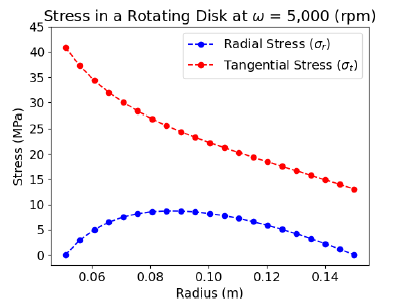
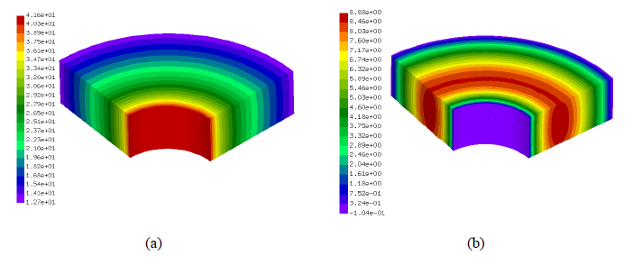
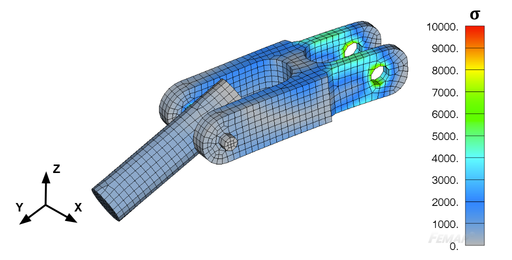
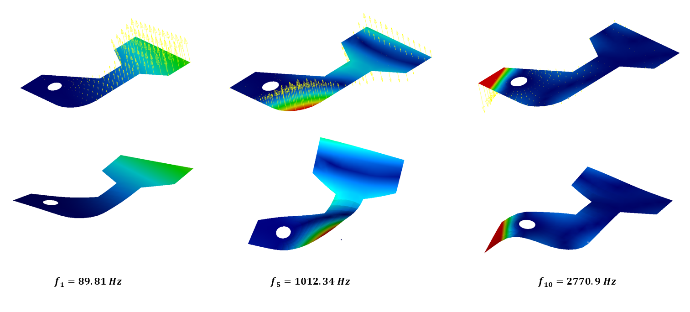
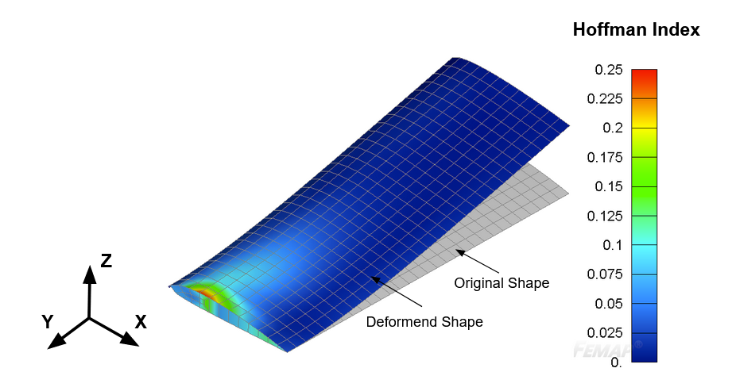

<h1 align="center">Finite Element Analysis (FEA) Project Portfolio</h1> 

Selected FEA projects that cover linear & nonlinear static analysis, buckling analysis, dynamic transient and frequency analysis, and modal analysis of composite & metallic structures.

**Technical Stack:**

*3D CAD*: Autodesk Fusion, Cubit

*FEA Solvers*: NASTRAN, CalculiX - ABAQUS-like finite element solver

*Pre- & Post-Processing Software*: FEMAP, PrePoMax

*Programming Languages*: Python, FORTRAN

### [1. Composite Laminate under Uniform Pressure](https://github.com/dmytrokuksenko/FEA-Portfolio/tree/main/cfrp-plate-bending)

This project is designed to assess the performance of the Linde material model in CalculiX. The model is designed to predict damage initiation and propagation in carbon composites. It's implemeted in CalculiX via the FORTRAN user subroutine. A simply supported laminate subjected to uniform pressure is used to assess the peformance of the Linde material model.     

Displecement (left) and von Mises stress (right) in the carbon composite laminate subjected to uniform pressure.

### [2. Three-Point Bending of a Composite Laminate](https://github.com/dmytrokuksenko/FEA-Portfolio/tree/main/cfrp-three-point-bend)

The stress analysis of the fiber-reinforced composite laminate subjected to three-point bending. The analysis evaluates the performance of the Linde material model implemented via the FORTRAN user subroutine in CalculiX. 

Prediction of the $\sigma_{11}$ stress distribution in a carbon composite laminate subjected to three-point bending using built-in (left) and Linde (right) material models.

### [3. Filament-Wound Thick Pipe under Internal Pressure](https://github.com/dmytrokuksenko/FEA-Portfolio/tree/main/cylindrical-shell)

Stress analysis of a thick pipe consisting of steel (inner portrion) and a filament-wound carbon composite (outer portion). The pipe is subjected to internal pressure. The project is designed to evaluate the assginment of orthotropic material properties in cylindrical coordiante system using the open-source software CalculiX.  

The prediction of $\sigma_{\theta}$ stress in a pressure pipe made out of steel and filament-wound carbon composite.

### [4. UMAT for Damage Initiation and Propagation in Carbon Composites](https://github.com/dmytrokuksenko/FEA-Portfolio/tree/main/umat-single-element)

Complex failure mechanisms of carbon composites necessitate the application of advanced material models to accurately simulate damage initiation and propagation. This project describes the implementation and performance assessment of several custom material models - Maximum Stress, Maximum Strain, Tsai-Wu, Linde, and Hashin, for prediction of damage in carbon composites. 

Prediction of damage initiation and propagaiton using different UMAT material model for carbon composites in a single-element FEA model subjected to displacement in longitudinal (fibers' direction). 

### [5. Buckling Analysis of a Cylindrical Composite Shell](https://github.com/dmytrokuksenko/FEA-Portfolio/tree/main/cfrp-shell-buckling)

**Executive Summary**: TO BE ADDED

### [6. Stress Distribution in a Solid Circular Rotating Disk](https://github.com/dmytrokuksenko/FEA-Portfolio/tree/main/solid-disk)

**Executive Summary**: TO BE ADDED

### [7. Static Analysis of the Assembly](https://github.com/dmytrokuksenko/FEA-Portfolio/tree/main/femap-assembly)

**Executive Summary**: TO BE ADDED

### [8. Modal Frequency Analysis of a Hinge](https://github.com/dmytrokuksenko/FEA-Portfolio/tree/main/femap-modal-frequency-hinge)

**Executive Summary**: TO BE ADDED

### [9. Random Response of a Hinge Model](https://github.com/dmytrokuksenko/FEA-Portfolio/tree/main/femap-random-response-hinge)

**Executive Summary**: TO BE ADDED

### [10. Composite Wing Design & Analysis](https://github.com/dmytrokuksenko/FEA-Portfolio/tree/main/composite-wing)

**Executive Summary**: 

### [11. Shock Spectrum Response Analysis of Composite Pressure Vessel](https://github.com/dmytrokuksenko/FEA-Portfolio/tree/main/femap-random-response-hinge)

**Executive Summary**: TO BE ADDED

### [12. Boeing Landing Gear Stress Analysis](https://github.com/dmytrokuksenko/FEA-Portfolio/tree/main/femap-random-response-hinge)

**Executive Summary**: TO BE ADDED
